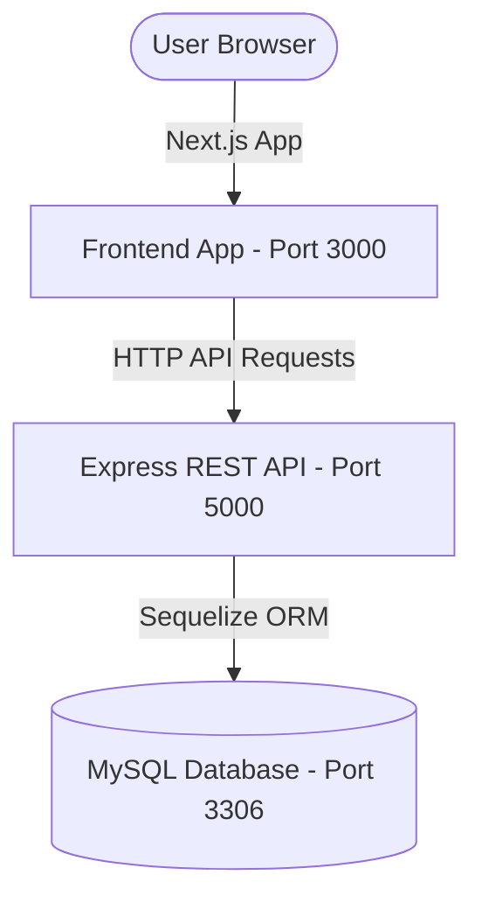

# BugSentinel 🛡️

BugSentinel is a high-fidelity, production-grade defect lifecycle and issue tracking platform. Designed with premium dark-mode aesthetics, rich glassmorphism layouts, and role-based workflows, it equips engineering teams with real-time operational health insights, automated SLA deadlines, and detailed tamper-evident audit trails.

---

## 🔍 About BugSentinel
BugSentinel is a two-tier application built to manage the complexity of software bugs. It moves away from generic, cluttered bug-reporting spreadsheets, introducing an interactive workspace where:
- **Testers** file defects with precise severity and technical logs.
- **Administrators** orchestrate work, assign tickets to developers, and manage project lifecycles.
- **Developers** claim assigned tickets, document comment threads, and transition bug statuses to resolution.

All actions are strictly governed by role permissions and tracked via visual Service Level Agreements (SLAs).

---

## ⚡ Key Features

### Role-Based Access Control (RBAC)
System privileges are gated based on three distinct, well-defined security roles:
*   **Administrators:** Full management capability. Create/edit/delete projects, assign/re-assign bugs to developers, and permanently purge or restore items from the recycle bin.
*   **Developers:** Claim unassigned bugs, assign tickets to themselves, post comments, and resolve defects. Restricted from editing priorities, severities, or reporting bugs.
*   **Testers:** File defects and write technical reproduction comments. Restricted from claiming bugs, updating assignee fields, or editing ticket metadata.

### Chronos SLA Countdown Engine
Enforces resolution deadlines based on ticket priority to maintain strict Service Level Agreements (SLAs).
*   **Priority Milestones:**
    *   `Critical`: 24 Hours
    *   `High`: 72 Hours
    *   `Medium`: 5 Days
    *   `Low`: 10 Days
*   **Visual Timers:** Real-time ticking countdown clocks and color-coded progress bars (Indigo for Safe, Pulsing Orange for Urgent `< 4h`, and Pulsing Red for Breached) displayed in detail panels.
*   **SLA Resolution:** Resolving or closing a ticket captures the resolution timestamp, flagging the SLA state as `Met` or `Breached`. Project deletions automatically place SLA tracking in a `Suspended` state.

### Operational Analytics Dashboard
Provides managers and teams with a central dashboard containing aggregate KPIs and visual breakdowns:
*   **Headcount KPIs:** Active summaries of registered Administrators, Developers, and Testers.
*   **Interactive Status Breakdown:** An SVG-rendered Donut Chart illustrating the proportion of bugs in `Open`, `Assigned`, `In Progress`, `Testing`, `Resolved`, and `Closed` states.
*   **Priority Distribution:** An SVG-rendered Bar Chart showing ticket density from Low to Critical.
*   **System Activity Feed:** A real-time timeline showing the latest audit logs of comments, state updates, and projects across the team.

### Tamper-Evident Audit Trails
Every mutation is logged with timestamps, actor IDs, and payload metadata:
*   Includes bug creation, status transitions, comments posted, comments deleted, assignments changed, and project actions.
*   Deleted comments leave an audit entry logging the author's name, action, and comment snippet.

### Project Abandonment & Archiving
Safeguards data integrity when projects are soft-deleted or permanently removed:
*   When a project is soft-deleted, all associated bugs are automatically archived and locked from status transitions, comment additions, or assignee claims.
*   If the project is restored, active SLA tracking and status editing resume seamlessly.

---

## 🏗️ System Architecture
BugSentinel is split into two independent services:



---

## 🛠️ Technology Stack

### Frontend Service
- **Framework:** Next.js (App Router, Client Components)
- **State Management:** React Context API (Auth & Toast Notifications)
- **Styling:** Vanilla CSS layout utilities (sleek neon glassmorphism themes)
- **Client Queries:** Native `fetch` wrapper with automatic JWT Bearer token injection

### Backend Service
- **Engine:** Node.js & Express
- **ORM:** Sequelize (MySQL Dialect, automatic DB schemas sync)
- **Security:** bcryptjs (password hashing), jsonwebtoken (JWT-based stateful validation middleware)
- **Testing:** Native Node HTTP integration suite (`test_api.js` in-memory SQLite runner)

---

## 🚀 Local Installation & Setup

### Prerequisites
- [Node.js](https://nodejs.org/) (v16+ recommended)
- [MySQL Server](https://www.mysql.com/) running locally or in a container

---

### Backend Setup
1. Navigate to the backend directory:
   ```bash
   cd backend
   ```
2. Install dependencies:
   ```bash
   npm install
   ```
3. Create a `.env` file in the `backend/` root directory:
   ```env
   PORT=5000
   NODE_ENV=development
   JWT_SECRET=your_jwt_super_secret_key
   DB_HOST=localhost
   DB_PORT=3306
   DB_NAME=bug_tracker_db
   DB_USER=root
   DB_PASSWORD=your_mysql_password
   ```
4. Start the backend development server (this automatically synchronizes database models):
   ```bash
   npm start
   ```

---

### Frontend Setup
1. Navigate to the frontend directory:
   ```bash
   cd ../frontend
   ```
2. Install dependencies:
   ```bash
   npm install
   ```
3. Start the Next.js development server:
   ```bash
   npm run dev
   ```
4. Access the web app at `http://localhost:3000`.

---

## 🐳 Containerization & Deployment (Docker)

Docker allows you to spin up the entire BugSentinel suite (Next.js frontend, Express API backend, and MySQL database) in seconds without installing any local databases or runtime configurations.

### 1. Running Locally with Docker Compose
To build and start all services locally in detached (background) mode:
1.  Make sure you have [Docker Desktop](https://www.docker.com/products/docker-desktop/) installed and running.
2.  Run the following command from the root project directory:
    ```bash
    docker compose up -d --build
    ```
3.  **What happens under the hood:**
    *   Docker builds your custom Next.js frontend and Express backend containers.
    *   It pulls the official `mysql:8.0` image and creates a persistent database volume.
    *   The backend container automatically waits (using a healthcheck) until MySQL is fully booted and initialized before it connects.
    *   The application automatically executes database migrations and table syncs.
4.  **Access Points:**
    *   **Frontend Web App:** `http://localhost:3000`
    *   **Backend API Service:** `http://localhost:5000`
    *   **MySQL Database:** Exposed on port `3307` of your host computer (password: `password`, database: `mydatabase`).
5.  To stop and tear down all running containers and networks:
    ```bash
    docker compose down
    ```

---

### 2. Publishing Images to Docker Hub
To distribute your BugSentinel builds so other developers or production cloud environments can run them without compiling the source code:

1.  **Authenticate with Docker Hub:**
    ```bash
    docker login
    ```
2.  **Build and Tag the Images:**
    Replace `<your-dockerhub-username>` with your actual Docker Hub account handle:
    ```bash
    # Build & tag the Backend API
    docker build -t <your-dockerhub-username>/bugsentinel-backend:latest ./backend

    # Build & tag the Frontend UI
    docker build -t <your-dockerhub-username>/bugsentinel-frontend:latest ./frontend
    ```
3.  **Push the Images to the Registry:**
    ```bash
    docker push <your-dockerhub-username>/bugsentinel-backend:latest
    docker push <your-dockerhub-username>/bugsentinel-frontend:latest
    ```

---

### 3. Pulling and Running Prebuilt Images (No Source Code Needed)
Once your images are pushed to Docker Hub, anyone else can run your project instantly. They only need to create this simple `docker-compose.yml` file on their machine and run it (no source code, folders, or Dockerfiles required!):

```yaml
services:

  database: 
    image: mysql:8.0
    container_name: DatabaseContainer
    ports:
      - "3307:3306"
    environment:
      MYSQL_ROOT_PASSWORD: password
      MYSQL_DATABASE: mydatabase
    volumes:
      - mysql_data:/var/lib/mysql
    healthcheck:
      test: ["CMD", "mysqladmin", "ping", "-h", "localhost", "-u", "root", "-ppassword"]
      interval: 5s
      timeout: 5s
      retries: 5

  backend:
    image: <your-dockerhub-username>/bugsentinel-backend:latest
    container_name: BackendContainer
    ports:
      - "5000:5000"
    environment:
      - DB_HOST=database
      - DB_USER=root
      - DB_PASSWORD=password
      - DB_NAME=mydatabase
    depends_on:
      database:
        condition: service_healthy

  frontend:
    image: <your-dockerhub-username>/bugsentinel-frontend:latest
    container_name: FrontendContainer
    ports:
      - "3000:3000"
    depends_on:
      - backend

volumes:
  mysql_data:
```

To start the prebuilt containers, they simply run:
```bash
docker compose up -d
```
