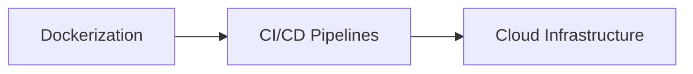

# BugSentinel: Cloud Migration & Deployment Blueprint

This document outlines the engineering plan to transition BugSentinel from a local development workspace to a containerized, continuously deployed, and fully managed cloud infrastructure.

---

## 📋 Road Map


- **Phase 1: Containerization** - Package the frontend, backend, and database dependencies into portable Docker containers.
- **Phase 2: CI/CD Pipelines** - Set up automatic build checks, lints, integration tests, and container image generation on every push.
- **Phase 3: Cloud Infrastructure (AWS)** - Deploy the backend via container orchestration, host the frontend at edge locations, and configure a fully managed database.

---

## 🐳 Phase 1: Containerization (Docker)

### 1. Backend Dockerfile (`backend/Dockerfile`)
A multi-stage, production-optimized Dockerfile based on Node Alpine to keep image size minimal and secure:
```dockerfile
# Stage 1: Build
FROM node:18-alpine AS builder
WORKDIR /app
COPY package*.json ./
RUN npm ci
COPY . .

# Stage 2: Production Runtime
FROM node:18-alpine AS runner
WORKDIR /app
COPY --from=builder /app/package*.json ./
COPY --from=builder /app/node_modules ./node_modules
COPY --from=builder /app/Models ./Models
COPY --from=builder /app/Controllers ./Controllers
COPY --from=builder /app/Middleware ./Middleware
COPY --from=builder /app/Routes ./Routes
COPY --from=builder /app/db.js ./db.js
COPY --from=builder /app/main.js ./main.js

ENV NODE_ENV=production
ENV PORT=5000
EXPOSE 5000

USER node
CMD ["node", "main.js"]
```

### 2. Frontend Dockerfile (`frontend/Dockerfile`)
Containerizes the Next.js app to run as a Node daemon or produce static assets:
```dockerfile
# Stage 1: Build
FROM node:18-alpine AS builder
WORKDIR /app
COPY package*.json ./
RUN npm ci
COPY . .
RUN npm run build

# Stage 2: Production Runtime
FROM node:18-alpine AS runner
WORKDIR /app
COPY --from=builder /app/package*.json ./
COPY --from=builder /app/.next ./.next
COPY --from=builder /app/public ./public
COPY --from=builder /app/node_modules ./node_modules

ENV NODE_ENV=production
ENV PORT=3000
EXPOSE 3000

USER node
CMD ["npm", "start"]
```

### 3. Multi-Container Orchestration (`docker-compose.yml`)
Allows spinner setup of the entire local stack (Frontend, Backend, and MySQL) with networking and persistent volumes:
```yaml
version: '3.8'

services:
  database:
    image: mysql:8.0
    container_name: bugsentinel-db
    restart: always
    environment:
      MYSQL_DATABASE: bug_tracker_db
      MYSQL_ROOT_PASSWORD: root_db_password
    ports:
      - "3306:3306"
    volumes:
      - db_data:/var/lib/mysql
    networks:
      - sentinel-network
    healthcheck:
      test: ["CMD", "mysqladmin", "ping", "-h", "localhost", "-u", "root", "-proot_db_password"]
      interval: 10s
      timeout: 5s
      retries: 5

  backend:
    build:
      context: ./backend
      dockerfile: Dockerfile
    container_name: bugsentinel-backend
    restart: always
    environment:
      PORT: 5000
      NODE_ENV: production
      JWT_SECRET: prod_secret_jwt_key
      DB_HOST: database
      DB_PORT: 3306
      DB_NAME: bug_tracker_db
      DB_USER: root
      DB_PASSWORD: root_db_password
    ports:
      - "5000:5000"
    depends_on:
      database:
        condition: service_healthy
    networks:
      - sentinel-network

  frontend:
    build:
      context: ./frontend
      dockerfile: Dockerfile
    container_name: bugsentinel-frontend
    restart: always
    ports:
      - "3000:3000"
    depends_on:
      - backend
    networks:
      - sentinel-network

volumes:
  db_data:

networks:
  sentinel-network:
    driver: bridge
```

---

## 🔄 Phase 2: CI/CD Pipelines (GitHub Actions)

Upon code submission (`git push` or PR merge), an automated workflow executes:
1.  **Code Check & Lint:** Installs dependencies and runs ESLint formatters.
2.  **Integration Testing:** Spins up an ephemeral SQLite database in-memory and runs the integration test suite (`test_api.js`) to guarantee endpoints and role policies are not broken.
3.  **Container Registry Push:** Builds production Docker images and pushes them to AWS ECR (Elastic Container Registry) or Docker Hub.

### Workflow Configuration (`.github/workflows/ci-cd.yml`)
```yaml
name: BugSentinel CI/CD Pipeline

on:
  push:
    branches: [ main, release/* ]
  pull_request:
    branches: [ main ]

jobs:
  validate-and-test:
    runs-on: ubuntu-latest
    steps:
      - name: Checkout Code
        uses: actions/checkout@v3

      - name: Setup Node.js
        uses: actions/setup-node@v3
        with:
          node-version: 18
          cache: 'npm'
          cache-dependency-path: './backend/package-lock.json'

      - name: Backend Linters & Tests
        run: |
          cd backend
          npm ci
          # Run Sequelize model and endpoint test suite (using SQLite in-memory mode)
          node test_api.js

      - name: Frontend Linter & Build Validation
        run: |
          cd frontend
          npm ci
          npm run build

  build-and-ship:
    needs: validate-and-test
    if: github.ref == 'refs/heads/main' && github.event_name == 'push'
    runs-on: ubuntu-latest
    steps:
      - name: Checkout Code
        uses: actions/checkout@v3

      - name: Configure AWS Credentials
        uses: aws-actions/configure-aws-credentials@v2
        with:
          aws-access-key-id: ${{ secrets.AWS_ACCESS_KEY_ID }}
          aws-secret-access-key: ${{ secrets.AWS_SECRET_ACCESS_KEY }}
          aws-region: us-east-1

      - name: Log in to AWS ECR
        id: login-ecr
        uses: aws-actions/amazon-ecr-login@v1

      - name: Build and Push Backend Image
        env:
          ECR_REGISTRY: ${{ steps.login-ecr.outputs.registry }}
          ECR_REPOSITORY: bugsentinel-backend
          IMAGE_TAG: ${{ github.sha }}
        run: |
          docker build -t $ECR_REGISTRY/$ECR_REPOSITORY:$IMAGE_TAG -t $ECR_REGISTRY/$ECR_REPOSITORY:latest ./backend
          docker push $ECR_REGISTRY/$ECR_REPOSITORY --all-tags

      - name: Build and Push Frontend Image
        env:
          ECR_REGISTRY: ${{ steps.login-ecr.outputs.registry }}
          ECR_REPOSITORY: bugsentinel-frontend
          IMAGE_TAG: ${{ github.sha }}
        run: |
          docker build -t $ECR_REGISTRY/$ECR_REPOSITORY:$IMAGE_TAG -t $ECR_REGISTRY/$ECR_REPOSITORY:latest ./frontend
          docker push $ECR_REGISTRY/$ECR_REPOSITORY --all-tags
```

---

## ☁️ Phase 3: Cloud Infrastructure (AWS Target)

The recommended cloud architecture ensures high availability, security, and scalability by separating frontend assets from backend processing.

```
                  ┌────────────────────────────────────────────────────────┐
                  │                 AWS Cloud (us-east-1)                  │
                  │                                                        │
                  │   ┌────────────┐        ┌──────────────────────────┐   │
                  │   │  Route 53  │        │       CloudFront         │   │
  User Browser ───┼──►│   (DNS)    │───────►│  (Static CDN Caching)    │   │
                  │   └────────────┘        └────────────┬─────────────┘   │
                  │                                      │                 │
                  │                                      ▼                 │
                  │                              ┌──────────────┐          │
                  │                              │  S3 Bucket   │          │
                  │                              │ (Frontend UI)│          │
                  │                              └──────────────┘          │
                  │                                      │                 │
                  │                                      ▼                 │
                  │                             ┌─────────────────┐        │
                  │                             │    ALB / WAF    │        │
                  │                             │ (Load Balancer) │        │
                  │                             └────────┬────────┘        │
                  │                                      │                 │
                  │                 ┌────────────────────┴────────────────┐│
                  │                 │  VPC (Private Subnet Isolation)     ││
                  │                 │                                     ││
                  │                 │     ┌────────────────────────┐      ││
                  │                 │     │   ECS Fargate Tasks    │      ││
                  │                 │     │    (Backend Server)    │      ││
                  │                 │     └───────────┬────────────┘      ││
                  │                 │                 │                   ││
                  │                 │                 ▼                   ││
                  │                 │     ┌────────────────────────┐      ││
                  │                 │     │     RDS MySQL DB       │      ││
                  │                 │     │     (Multi-AZ DB)      │      ││
                  │                 │     └────────────────────────┘      ││
                  │                 └─────────────────────────────────────┘│
                  └────────────────────────────────────────────────────────┘
```

### 1. Networking Infrastructure (VPC & Subnets)
- **AWS VPC:** Isolated subnet division (CIDR `10.0.0.0/16`).
- **Public Subnets:** Multi-AZ public subnets hosting the Application Load Balancer (ALB) and NAT Gateways.
- **Private Subnets:** Multi-AZ private subnets hosting backend ECS containers and RDS MySQL instances, preventing direct public exposure.

### 2. Managed Database Layer (AWS RDS)
- **Service:** Amazon RDS MySQL (Engine v8.0).
- **Configuration:** Multi-AZ deployment for automated hardware failovers and real-time replicas.
- **Storage:** General Purpose SSD (gp3) with auto-scaling storage enabled.
- **Security:** Placed in Private Subnets with Security Group rules restricting access to incoming connections from the ECS cluster security group only.

### 3. Serverless Compute Layer (AWS ECS Fargate)
- **Service:** Amazon Elastic Container Service (ECS) with Fargate launch type (eliminating EC2 provisioning).
- **Deployment:** Behind an Application Load Balancer (ALB) configured with auto-scaling metrics (e.g., target CPU utilization at 70%).
- **Secrets Management:** Secrets (JWT keys, DB credentials) injected at startup from AWS Secrets Manager.

### 4. Content Delivery Network (AWS S3 & CloudFront)
- **Frontend Storage:** Frontend code is statically exported (`next export`) and stored on Amazon S3.
- **CDN Edge Distribution:** Amazon CloudFront caches static HTML, Javascript, CSS, and asset files closer to users, securing the site with SSL certificates via AWS Certificate Manager (ACM).
- **DNS Hosting:** Amazon Route 53 routes request traffic to CloudFront (frontend) and ALB (backend API endpoint under `api.yourdomain.com`).
